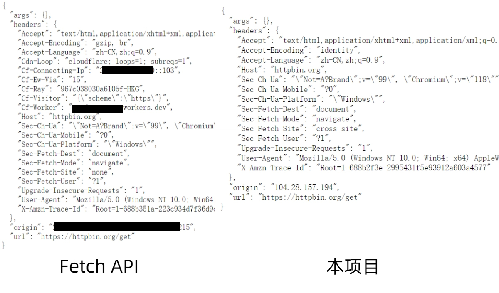

# SpectreProxy


支持HTTP，Websocket，DoH/DoT协议，使用原生 TCP Socket 解决 `fetch` API 的隐私泄露问题并提供灵活的回退策略解决TCP Socket 目前无法连接到 Cloudflare 自身的 IP 段的问题的Cloudflare Worker代理程序。

## **免责声明**：

本项目是一个用于学习和理解 Cloudflare Worker 机制的示例，仅供个人学习和研究网络技术之用，**严禁用于任何非法目的**。

任何使用者在使用本项目时，均应遵守其所在国家或地区的法律法规。对于任何因使用或滥用本项目而导致的任何直接或间接的法律责任和风险，**均由使用者本人承担**，作者，贡献者不对任何第三方使用本项目进行的任何非法活动及其造成的任何损害承担责任。

如果您开始使用本项目，即表示您已充分理解并同意上述条款。

## 项目背景

Cloudflare Workers 的 `fetch` API 是一个功能强大的工具，可以轻松实现反向代理。然而，它会自动在请求中添加特定的 `CF-*` 请求头，例如：

- `cf-connecting-ip`：暴露发起请求用户的真实 IP 地址。
- `cf-ipcountry`：暴露用户所在的国家/地区。
- `cf-worker`：明确标识该请求经过了 Cloudflare Workers。

这些请求头无法通过常规方式移除，会导致以下问题：

1. **隐私泄露**：用户的真实 IP 被暴露给目标服务器。
2. **访问限制**：部分对国家/地区有限制的服务（如流媒体）会因 `cf-country` 而拒绝访问。
3. **代理暴露**：目标网站可以轻易识别出请求来自 Cloudflare Workers，甚至可能因此封禁域名。

### 与fetch api对比



## 核心原理与特性

为解决上述问题，SpectreProxy 采用了更底层的解决方案。

### 核心原理

项目通过 Cloudflare Workers 的 **原生 TCP Socket API** (`connect()`) 直接构建 HTTP/1.1、WebSocket 及 DNS 请求。这种方式可以完全控制请求的每一个字节，从根源上避免了 `fetch` API 自动添加的、可能泄露隐私的请求头。

### Fallback机制

本机制只适用于HTTP请求，DNS请求采取Socket请求失败则使用Fetch API。

Websocket 只兼容Socket，Fetch，socks5策略。

考虑到 Cloudflare [官方文档](https://developers.cloudflare.com/workers/runtime-apis/tcp-sockets/) 指出，TCP Socket 目前无法连接到 Cloudflare 自身的 IP 段，SpectreProxy 采用了回退机制。当 Socket 连接失败时，它会自动切换到预设的备用策略，目前支持：

- 使用标准 `fetch`。
- 通过 SOCKS5 代理转发。
- 转发到第三方 HTTP 代理（需在第三方 HTTP 代理中去除CF请求头）。
- 转发到部署在其他云平台的兼容此项目的代理。（需在其他云平台中去除CF请求头）

#### 策略比对

| 策略              | fetch (直接连接)            | SOCKS5 代理转发      | 第三方 HTTP 代理                                           | 其他云平台兼容代理                                           |
| :---------------- | :-------------------------- | :------------------- | :--------------------------------------------------------- | :----------------------------------------------------------- |
| **部署与操作**    | **最简单**，无需额外部署    | 需额外部署SOCKS5服务 | 需额外部署HTTP代理服务                                     | 需要在其他云平台部署，如Vercel                               |
| **隐私泄露风险**  | **会泄露** (泄露用户真实IP) | **不会泄露**         | **不会泄露**                                               | **会泄露部分隐私** (泄露其他云平台HOST，不泄露真实IP)        |
| **WebSocket支持** | ✅ 支持                      | ✅ 支持               | ❌ 默认不支持                                               | ❌ 默认不支持，如果其他云平台支持，可以修改CloudProviderProxy 进行适配 |
| **成本**          | 无                          | 取决于SOCKS5服务     | **成本低廉甚至免费**                                       | 可利用免费平台 (如Vercel)                                    |
| **性能**          | 性能佳                      | 取决于代理服务       | 取决于代理服务                                             | 取决于云平台及代理实现                                       |
| **兼容性**        | 最好                        | 良好                 | 良好                                                       | 良好                                                         |
| **备注**          | -                           | -                    | 可用`proxy.php`部署到PHP虚拟空间，虚拟空间价格低廉甚至免费 | 可以参考开发指南进行开发，并进行混淆，降低特征               |

### 主要特性

- **隐私保护**：通过原生 Socket 隐藏真实 IP 和代理痕迹，保护用户隐私。
- **多协议支持**：原生支持 HTTP/S、WebSocket (WSS)，以及 DNS-over-HTTPS (DoH) / DNS-over-TLS (DoT) 查询。
- **灵活的代理策略**：支持多种主/备用代理策略，可按需组合。
- **高可用性**：智能回退机制确保在主策略失效时，服务依然可用。
- **易于部署**：单个 Worker 脚本，无需复杂的外部依赖。

## 部署指南

1. **准备 Cloudflare 环境** 确保你拥有一个 Cloudflare 账号，并已激活 Workers 服务。
2. **创建 Worker** 在 Cloudflare 控制面板中，`计算(Workers)`->`Work ers 和 Pages` > `创建 `->`从 Hello World! 开始`->`部署` -> `继续处理项目` ->  `编辑代码`
3. **复制代码** 复制项目中的 `single.js` 文件的全部内容，粘贴到 worker.js 中，部署。
4. **配置环境变量** 在 Worker 的 `设置` > `变量` 页面中，根据个人需求添加以下环境变量以完成配置。

## 环境变量配置

你可以根据需求配置以下环境变量。

| 环境变量                  | 默认值                      | 说明                                                         |
| ------------------------- | --------------------------- | ------------------------------------------------------------ |
| `AUTH_TOKEN`              | `"your-atuh-token"`         | **访问代理所需的认证密钥，务必修改**                         |
| `DEFAULT_DST_URL`         | `"https://httpbin.org/get"` | 当不指定目标时，默认访问的 URL。                             |
| `DEBUG_MODE`              | `false`                     | 是否开启调试模式，开启后会在响应中输出更多日志信息。         |
| `PROXY_STRATEGY`          | `"socket"`                  | **主代理策略**。                                             |
| `FALLBACK_PROXY_STRATEGY` | `"fetch"`                   | **回退代理策略**。当主策略失败时启用。可选值:  `fetch`, `socks5`, `thirdparty`, `cloudprovider`, `doh`, `dot`。 |
| `PROXY_IP`                | `""`                        | 暂未实现，无需填写                                           |
| `SOCKS5_ADDRESS`          | `""`                        | SOCKS5 代理地址，格式为 `host:port`或`user:password@host:port` |
| `THIRD_PARTY_PROXY_URL`   | `""`                        | 第三方 HTTP 代理的 URL。                                     |
| `CLOUD_PROVIDER_URL`      | `""`                        | 部署在其他云服务商（如 Vercel）的兼容代理 URL。              |
| `DOH_SERVER_HOSTNAME`     | `"dns.google"`              | DoH 服务器的主机名。                                         |
| `DOH_SERVER_PORT`         | `443`                       | DoH 服务器的端口。                                           |
| `DOH_SERVER_PATH`         | `"/dns-query"`              | DoH 服务器的查询路径。                                       |
| `DOT_SERVER_HOSTNAME`     | `"dns.google"`              | DoT 服务器的主机名。                                         |
| `DOT_SERVER_PORT`         | `853`                       | DoT 服务器的端口。                                           |


## 使用方法

通过构造特定的 URL 路径来使用代理功能。

**URL 基本格式:**

```
https://<你的Worker地址>/<认证令牌>/<协议>/<目标地址>
```

### 1. HTTP/HTTPS 代理

代理标准的 HTTP 和 HTTPS 请求。

**URL 格式:** `https://<YOUR_WORKER_URL>/<AUTH_TOKEN>/被代理的URL（包含https://或http://协议头）` 

### 2. WebSocket (WSS) 代理

代理 WebSocket 连接，协议需指定为 `ws` 或 `wss`。

**URL 格式:** `wss://<YOUR_WORKER_URL>/<AUTH_TOKEN>/ws/<TARGET_WS_SERVER>` `wss://<YOUR_WORKER_URL>/<AUTH_TOKEN>/wss/<TARGET_WS_SERVER>`

### 3. DOH/DOT

**URL 格式:** `https://<YOUR_WORKER_URL>/<AUTH_TOKEN>/dns/doh或dot`

**请求方法:** `POST` **请求头:** `Content-Type: application/dns-message`

 **请求体 (Body):** 标准的 DNS 查询数据 (二进制)。

## 兼容性测试/常用平台用法

Google Gemini √（无需额外配置）（https://<YOUR_WORKER_URL>/<AUTH_TOKEN>/https://generativelanguage.googleapis.com/v1beta）

OpenAi √ （fallback不为fetch）(https://<YOUR_WORKER_URL>/<AUTH_TOKEN>/https://api.openai.com/v1/responses)

Claude √（fallback不为fetch）(https://<YOUR_WORKER_URL>/<AUTH_TOKEN>/https://api.anthropic.com)

Newapi √ （渠道的 **API地址：** 地址中填写https://<YOUR_WORKER_URL>/<AUTH_TOKEN>/原来的API地址）

CherryStudio √ 

Cohere √ （https://<YOUR_WORKER_URL>/<AUTH_TOKEN>/https://api.cohere.ai）
## 开发指南

### 项目结构

```

├── README.md               # 项目说明文档
├── index.js                # 标准部署入口文件
├── single.js               # 单文件部署版本，方便快速复制粘贴
├── src/                    # 源代码目录
│   ├── main.js             # 代理核心处理逻辑
│   ├── config.js           # 默认配置与环境变量管理
│   ├── proxy-factory.js    # 代理实例创建工厂
│   └── proxies/            # 存放所有代理协议的具体实现
│       ├── base.js         # 所有代理的抽象基类
│       ├── socket.js       # 原生 TCP Socket 实现 (HTTP/WSS)
│       ├── fetch.js        # 标准 Fetch API 实现
│       ├── socks5.js       # SOCKS5 代理实现
│       ├── third-party.js  # 第三方 HTTP 代理实现
│       ├── cloud-provider.js # 其他云平台代理实现
│       ├── doh.js          # DNS-over-HTTPS (DoH) 实现
│       └── dot.js          # DNS-over-TLS (DoT) 实现

```


### 第三方HTTP代理

需要在第三方代理中实现：

1. **接收** 来自 Cloudflare Worker 的特殊 HTTP 请求。
2. **转发** 解析请求后，向真正的目标服务器发起新请求。
3. **响应** 将目标服务器的响应原封不动地返回给 Cloudflare Worker。

这个代理需要是一个**公开的 HTTP(S) 端点**，或通过类似此项目，通过URL中的authtoken进行认证。例如 `https://my-proxy-service.com/proxy`。

当 Cloudflare Worker 调用时，它会在 URL 中附加一个关键参数 **`target`**，格式为： `[您的代理URL]?target=[原始目标URL]`

第三方HTTP代理需要解析这个请求：首先**获取并验证 `target` 参数**，如果无效则返回 400 错误。然后获取原始请求的**方法 (Method)**、**请求头 (Headers)** 和**请求体 (Body)**。

然后使用获取到的信息，向 `target` URL 发起一个新请求。**关键在于处理请求头**：

- **必须移除 `Host` 头**，因为您的 HTTP 客户端会自动生成正确的 `Host`。
- 建议移除 `cf-` 和 `x-forwarded-` 系列的头部，以保护隐私和减少冗余。

最后，当收到目标服务器的响应后，**将其完整地传回**给 Cloudflare Worker。这包括**状态码 (Status Code)** 和**响应体 (Body)**。在处理响应头时，请务必**移除 `Transfer-Encoding` 头**，以避免客户端解析错误。

###  其他云平台兼容代理

**核心工作原理**与第三方HTTP代理一致。

您需要创建一个 Serverless Function，它会暴露一个公开的 URL (例如 `api/proxy.js`)。

当 Cloudflare Worker 调用它时，会在 URL 中附加一个关键参数 **`target`**，格式为： `[您的函数URL]?target=[原始目标URL]`

您的函数代码需要获取 `target` URL、请求方法、头和体。最核心的部分是使用 `fetch` API 将请求转发到 `target`。**关键在于处理请求头**：

- **必须移除 `Host` 头**，因为 `fetch` 会自动生成正确的 `Host`。
- 建议移除 `cf-*` 和 `x-forwarded-*` 系列的头，以隐藏代理链。

最后，将从目标服务器获取的 `Response` 对象**直接返回**即可，Serverless 平台会自动高效地处理流式响应。

示例代码，请勿直接使用，建议混淆：

```javascript
export default async function handler(request) {
  // 1. 获取 target URL
  const { searchParams } = new URL(request.url);
  const targetUrl = searchParams.get('target');

  if (!targetUrl) {
    return new Response('Error: Missing "target" URL parameter.', { status: 400 });
  }

  // 安全检查，确保 target 是有效的 http/https URL
  try {
    const url = new URL(targetUrl);
    if (url.protocol !== 'http:' && url.protocol !== 'https:') {
        throw new Error('Invalid protocol.');
    }
  } catch (err) {
    return new Response('Error: Invalid "target" URL parameter.', { status: 400 });
  }

  // 2. 构造转发请求的头部
  const forwardHeaders = new Headers(request.headers);
  forwardHeaders.delete('host'); // fetch 会自动设置

  for (const [key, value] of request.headers.entries()) {
      if (key.toLowerCase().startsWith('cf-') || key.toLowerCase().startsWith('x-forwarded-')) {
          forwardHeaders.delete(key);
      }
  }

  try {
    // 3. 使用 fetch 转发请求
    const response = await fetch(targetUrl, {
      method: request.method,
      headers: forwardHeaders,
      body: request.body,
      redirect: 'manual', // 必须设置，防止 fetch 自动处理重定向
    });

    // 4. 直接返回从目标服务器获取的响应
    return response;

  } catch (error) {
    return new Response(`Error connecting to target: ${error.message}`, { status: 502 });
  }
}

// 对于 Vercel Edge Runtime, 需额外配置
export const config = {
  runtime: 'edge',
};

```


## 开发/维护计划

### 已知问题

1.当DoT服务器为使用了cloudflare的网络的DoT服务器时，有时Fetch回退无法正常工作，目前的补丁方案为当Fetch请求也失败时，将向DoH服务器发送请求

### 高优先级

1.**功能更新：增加域名-方案匹配**：通过环境变量/KV/D1数据库存储域名-策略匹配规则，目前倾向于使用环境变量存储，不引入KV/D1增加复杂性

2.**修复和检测bug**

3.**混淆功能开发** ：开发兼容本项目的JS混淆工具，更新部署指南，推荐部署前混淆代码

4.**项目专精化**： 目前项目的src目录及index为实际开发使用，single.js是为了用户方便部署，将所有模块放到了一个文件中。计划开发AI API代理优化版，将只支持HTTP(S)和Websocket，并且不再设置fallback策略，针对socket进行优化，使用连接池，优化帧传输，流式传输和并发性能，预置常用平台的配置。

### 低优先级

1.Cloudflare Worker似乎有办法指定IP，然后手动进行TLS握手，似乎可以突破socket不能请求cloudflare网络的限制。

### 考虑中

1.**功能更新：增加proxyip策略** :仿照edgetunnel，使用cloudflare 的反向代理IP进行访问cloudflare的网络

## License

This project is licensed under the MIT License.